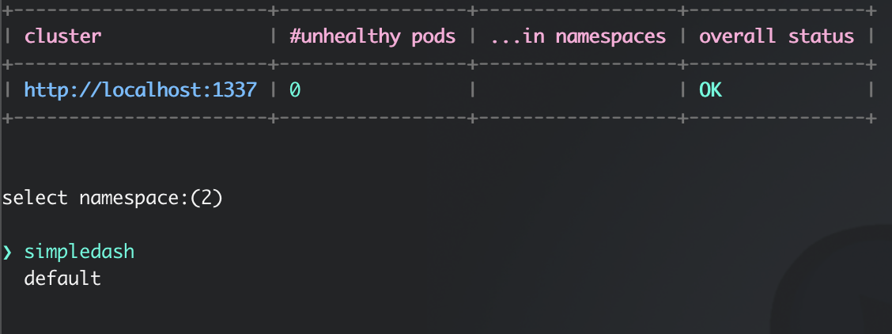
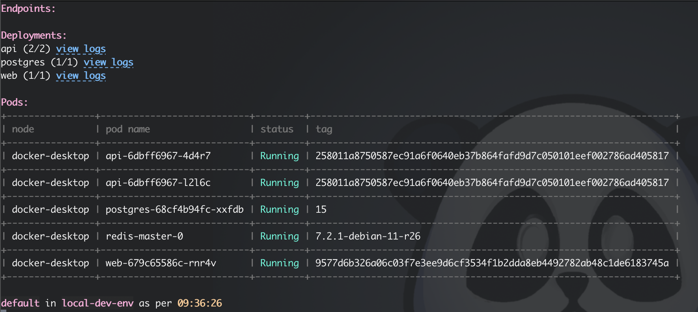

# simpledash CLI

a simple readonly CLI for [simpledash](https://github.com/hellgrenj/simpledash).  


It connects to the simpledash websocket server and displays a dashboard in the terminal.   
It will update the dashboard when the websocket server sends an update.  

screen 1: select a namespace  
  

screen 2: monitor the namespace (endpoints, deployments and pods). this screen auto updates when the websocket server sends an update. You can click on the view logs link and endpoint links.   


## Installation

linux x86_64:
```
curl -Lo sc https://github.com/hellgrenj/simpledash_cli/releases/download/v0.1.0/sc-linux-x86_64 && \
sudo install sc /usr/local/bin/
```
macos arm64:
```
curl -Lo sc https://github.com/hellgrenj/simpledash_cli/releases/download/v0.1.0/sc-macos-arm64 && \
sudo install sc /usr/local/bin/
```

## Usage

```sc -h https://your.simpledash.url```

### tips
If you have multiple simpledash servers create aliases for them in your .bashrc or .zshrc file.  
like this:  
```
alias stest="sc -h https://simpledash-test.mycompany.com"
alias sprod="sc -h https://simpledash-prod.mycompany.com"
```  
now you can just type ```stest``` or ```sprod``` to start the CLI for the different servers.


